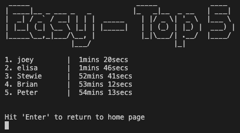

# MINESWEEPER GAME

# Table Of Contents
- [Minesweeper Project Overview](#minesweeper-project-overview)
   - [Live Project](#live-project-link-to-live-project)
   - [Project Introduction](#project-introduction)
- [Responsive Review](#responsive-review)
   - [Am I Responsive?](#am-i-responsive-link-to-responsive-review-website)
   - [Development Note on Responsive Design](#development-note-on-responsive-design)
- [User Experience (UX)](#user-experience-ux)
   - [Project Objectives](#project-objectives)
   - [HTML/CSS Design](#htmlcss-design)
   - [Wireframes](#wireframes)
   - [Features](#features)
- [Further Development](#further-development)
- [Technologies Used](#technologies-used)
   - [Languages Used](#languages-used)
   - [Frameworks, Libraries & Programs Used](#frameworks-libraries-and-programs-used)
- [Testing](#testing)
   - [HTML Validation](#html-validation)
   - [CSS Validation](#css-validation)
   - [JS Validation](#js-validation)
   - [Python PEP8 Validation](#python-pep8-validation)
   - [Testing User Stories from User Experience (UX) Section](#testing-user-stories-from-user-experience-ux-section)
   - [Further Testing](#further-testing)
   - [Development Bugs](#development-bugs)
   - [Key Learns](#key-learns)
- [Deployment](#deployment)
   - [Set Up APIs Using Google Cloud](#set-up-apis-using-google-cloud)
   - [Set Up Local GitHub Repository](#set-up-local-github-repository)
   - [Repository Framework](#repository-framework)
   - [Update Repository](#update-repository)
   - [Heroku Deployment](#heroku-deployment)
- [Credits](#credits)
   - [Development Resources](#development-resources)
   - [Media Resources](#media-resources)
   - [Acknowledgements](#acknowledgements)

 

# Minesweeper Project Overview
   ## Live Project [*(link to live project)*](https://minesweeper-python-project.herokuapp.com/)

   ## Project Introduction
   (**Note:** The aim of this project will be to develop the classic game 'Minesweeper'. This game will be developed using Python and will be deployed using mock terminal on the Heroku platform.

   Minesweeper is a challenging single player logic game where the user must select tiles on a grid without hitting a mine. If the user successfully selects a tile without hitting a mine, then the tile will provide information as to whether a mine or multiple mines are hidden within its neighbouring tiles. This is presented in the form of numbers, a tile with 3 mines in neighbouring tiles will present the user with the number 3.

   If the user selects all tiles on the grid without mines they win the game, however if they land on a tile hiding a mine the game is lost.

   If you would like to learn more about Minesweeper you can find more information here: https://en.wikipedia.org/wiki/Minesweeper_(video_game)

    

# Responsive Review

   ## Am I Responsive? [*(link to responsive review website)*](https://ui.dev/amiresponsive?url=https://minesweeper-python-project.herokuapp.com/)
   

   ## Development Note on Responsive Design
   The objective of this project was to develop a Python command-line application and was not focused on developing a responsive website. 
   As this was not in the scope of the project it was not given consideration.
   
    

# User Experience (UX)

   ## Project Objectives

   

      
Developer Goals

    

   As the developer I want to create a simple and engaging game that is easy to use and will result in users returning to the site. 
   * Easy to use functionality.
   * Addictive gameplay to encourage return users and drive positive word of mouth to encourage new users.
   * Provide clear instruction as to the rules of the game.
   * Set a range of difficulties to allow user progression and continued engagement.
   * Record winning scores based on difficulty and completion time to promote re-visitation and competition between users.
   * Build in flag functionality to allow users to mark cells they believe to have mines.
   * Build a appealing user interface whilst observing the limitations of the project scope (command-line application).
   
   ---
   

   

      
Developer Future Goals

    
   
   Points to consider for future development:
   * Potential to implement a more user-friendly interface such as tkinter or pygame (excluded as not in scope for this project).
   * Build to be responsive (excluded as not in scope for this project).
   * If responsive design is set-up then a customised difficulty could be implemented to allow the user to generate a board with a their desired size and number of mines. This was not feasible in this project as it may have exceeded the console size available.

   ---
   

   

      
First-Time User Goals

    

   Objectives for when a new user goes to the site for the first time:
   * Understand the purpose of the site.
   * Immediately engaged by easy to use yet challenging gameplay.
   * Invoke nostalgia.
   * Simple intuitive menu navigation.
   * Rules easily located and understood.

   ---
   

   

      
Returning User Goals

    
   
   Objectives for when a user returns to the site:
   * Use the scoreboard to improve their scores and compete with other users.
   * Tailor the difficulty to their experience with the game.

   ---
   

   ## HTML/CSS Design
   The focus of this project was to develop a command-line application. HTML and CSS development was not in scope for this project.

   However, I did tailor the course provided HTML and CSS files slightly to produce a more engaging user experience.

  

      
Background

    

   Utilised a SVG file from https://freesvg.org:
    

   

   ---

   

   

      
Position of terminal

    

   Centred the terminal console on the page and increased its size to cols: 80, rows: 50 to accommodate the game layout.
    

   

   ---

   

   

      
Run program button

    

   Button also centred and colours changed to be innkeeping with the game theme and background colour scheme.
    

   

   ---

   

   

      
Favicon

    
   
   Favicon updated for better user experience.
    
   
   

   ---

   

   ## Wireframes
   Only a skeleton plane has been developed for this project due to it being a command-line application and therefore having pre-set formatting.

   - [Skeleton Plane](https://www.figma.com/file/M0wxItI1Bx3Nh4LRIBNp1e/Untitled?node-id=0%3A1)

   **Note:** The structure and wireframes are only to act as a concept and are subject to change as the game development evolves.

   ## Features

   ### **Features planning**

   

      
Mind-Map

    

   The below image provides an initial mind-map into what features might be appropriate for the game based on the set objectives.

   
   If you have a LucidChart account, you can also view this Mind-Map [here](https://lucid.app/lucidspark/e0824881-e88c-4530-937e-03f8b923e9b2/edit?viewport_loc=-953%2C-1%2C3247%2C1693%2C0_0&invitationId=inv_d875bc30-8e51-4375-b0f2-c2a63991877b)
    

   ---

   

   

      
Priority Matrix

    

   The below maps out the feasibility of the features considered against the user value they provide to help establish the priority they have as part of the build.

   
   If you have a LucidChart account, you can also view this priority matrix [here](https://lucid.app/lucidspark/4b1e28c9-055d-4535-87d6-0f258286fe20/edit?viewport_loc=-2982%2C2311%2C4151%2C2041%2C0_0&invitationId=inv_67402cc9-c065-4b2a-ac9d-b9c360a0b967)
    

   Following this review the build order of the features will be broken down into phases:

   #### Phase 1:
   - Gameplay
   - Validations
   - Rules
   - Difficulty

   #### Phase 2:
   - Clear screen
   - Titles

   #### Phase 3:
   - Scoreboard
   - Username (useless without scoreboard)

   #### Phase 4 (Future enhancements - currently out of scope):
   - User interface (e.g. tkinter, pygame)

   ---

   

   

      
Process Flow

    

   The below details the process flow for the game from beginning to end.

    
   If you have a LucidChart account, you can also view this process flow [here](https://lucid.app/lucidchart/6f4a551a-5f6e-43eb-9645-1834994d4e27/edit?viewport_loc=-136%2C-64%2C3656%2C1771%2CI~k5YlUlNz8V&invitationId=inv_4642de00-28f1-4eff-8cd1-fe81b08e943d)
    

   ---

   

   

      
Functions Flow

    

   The below demonstrates the key game functions and how they interact with each other. It also details the inclusion of the Gameplay class.

    
   If you have a LucidChart account, you can also view this functions flow [here](https://lucid.app/lucidchart/6f4a551a-5f6e-43eb-9645-1834994d4e27/edit?viewport_loc=-391%2C-96%2C4221%2C2189%2CMrp4u2cXQ7zq&invitationId=inv_4642de00-28f1-4eff-8cd1-fe81b08e943d)
    

   ---
   
   

   

      
Class Requirements

    

   The below breaks down the Gameplay class detailing it's purpose, class variables and methods.

    
   If you have a LucidChart account, you can also view this class requirements [here](https://lucid.app/lucidchart/6f4a551a-5f6e-43eb-9645-1834994d4e27/edit?viewport_loc=-1010%2C-180%2C3889%2C2017%2CVWq4R58lY_hn&invitationId=inv_4642de00-28f1-4eff-8cd1-fe81b08e943d)
    

   ---
   
   

   ### **Features breakdown**

   Each section below will detail their specific function.
   

   

      
HTML/CSS

    

   The HTML and CSS development was not in scope for this project. However, small amendments were made to the template provided by the course to align better with the game aesthetics and accomodate the termainal size requirements.

   ---

   #### Console size and position
   Console was centred for a cleaner look.
   It was also increased from '80 columns by 24 rows' to '80 columns by 50 rows' to allow for additional info to be provided without the user needing to scroll on the page. This was especially inportant for higher difficulty games as the grid took up a substancial amount of the space available.

   
    

   ---

   #### SVG img
   An SVG image was used in the background.
   Due to the build, I was not able to implement a png background and instead input the SVG coordinates directly into the layout.html file.

   
    

   ---

   #### Favicon
   Favicon updated for better user experience. 
   This could not be achieved through the normal process of storing a favicon icon in the root directory and instead had to link to an external web image.

   
    

   ---

   

   

      
Titles

    

   To enhance the aesthetics of the game without using a interface library such as pygame or tkinter I used pyfiglet to make more engaging titles and to help the user separate and navigate the various pages/functions.

   ---

   #### Import required
      import pyfiglet
      from pyfiglet import figlet_format 
    

   ---
   #### Home page
   For the Intro and home page I wanted to generate a more impactful title. This would make users instantly aware of what they are playing and invoke a positive emotional response.

   
    

   ---

   #### Other pages
   For each of the other pages I also used pyfiglet to make an impactful title. 
   See an example of a title (rules) below.  
   This was applied to:
   - Rules
   - Scoreboard Selection
   - Scoreboard
   - Gameplay
   - Win
   - Gameover

   
    

   

   

      
Clear Board

    

   To ensure that the terminal does not get too cluttered, and the user is not provided more information than they need to play the game I utilised a clear function which I obtained from stack overflow: 
   https://stackoverflow.com/questions/517970/how-to-clear-the-interpreter-console

   This function was stored on another py sheet (format.py) to avoid clutter on the main run.py file.

   ---

   #### Import required
      import os
    

   ---

   #### Function code
      def cls(): 
         os.system('cls' if os.name=='nt' else 'clear')
    

   

   

      
Username

    

   Set a requirement for the user to enter a username. This username is passed through the functions and used in the scoreboard update if the user wins a game. 

   Upon playing a new game following a win or a loss the user will not be required to re-enter their username.

   ---

   #### Username format
   To appear consistently on the scoreboard each username was set to be 10 characters long. 
   This was achieved by running a while loop that added a space to the end of the word until it's length equalled 10.

      while len(user_name) < 10:
         user_name = user_name + " "
    

   ---

   

   

      
Rules

    

   Rules has little complexity and is simply a breakdown of the instructions required to play the game.

   This was spilt into 2 pages for readability and also to eliminate a bug identified in manual testing. This bug is detailed in the [Development Bugs](#development-bugs) section of this readme file.

   ---

   #### Imports required
   To format the title the pyfiglet is required. 

      import pyfiglet
      from pyfiglet import figlet_format
    

   ---

   #### Page 1
   This page provides a link to an instruction video on YouTube and the game objectives.
   It has an input field which will take any user-input entered to move onto the next page of the rules breaking down the instructions.

   
    

   ---

   #### Page 2
   This details the instruction required to play the game.
   It also has an input field which will take any user-input entered to move back to the home navigation page.

   
    

   ---

   

   

      
Scoreboard

    

   The scoreboard utilises the username which has been entered at the commencement of the game as well as the time the gameplay begins and ends if the user wins. It then updates a specific google sheet dependant on the difficulty the user played and presents the top 5 scores back to the scoreboard screen.

   ---

   #### Imports required
   This scoreboard requires an API link with google sheets. 

      import gspread
      from google.oauth2.service_account import Credentials

   To format the title the pyfiglet is required. 
   
      import pyfiglet
      from pyfiglet import figlet_format
    

   ---

   #### Define constants
   Using the tutorial provided as part of the 'love-sandwiches' course project, I defined the constants I would require to read and update the google sheet utilising the imports above. 
   (https://learn.codeinstitute.net/courses/course-v1:CodeInstitute+LS101+2021_T1/courseware/293ee9d8ff3542d3b877137ed81b9a5b/071036790a5642f9a6f004f9888b6a45/?child=first) 

      SCOPE = [
         "https://www.googleapis.com/auth/spreadsheets",
         "https://www.googleapis.com/auth/drive.file",
         "https://www.googleapis.com/auth/drive"
         ]

      CREDS = Credentials.from_service_account_file("creds.json")
      SCOPED_CREDS = CREDS.with_scopes(SCOPE)
      GSPREAD_CLIENT = gspread.authorize(SCOPED_CREDS)
      SHEET = GSPREAD_CLIENT.open("Minesweeper_scoreboard")
    

   ---
   
   #### Page 1
   This page allows the user to select the appropriate scoreboard. Each difficulty level has its own scoreboard (easy, medium, hard).

   
    

   ---

   #### Page 2
   Once the game is won, the game duration is calculated and recorded alongside the difficulty and username. This is then imported to the google sheets. 
   When the scoreboard page is called it presents back the top 5 scores on the specified google sheet whilst eliminating any unnecessary data (difficulty - because this is on the title, time in secs - shown in proper format)

   

   ---

   
    

   ---

   

   

      
Difficulty

    

   The difficulty page allows the user to select a level that is appropriate to their skill and experience with the game.

   ---

   #### Imports required
   To format the title the pyfiglet is required. 

      import pyfiglet
      from pyfiglet import figlet_format
    

   ---

   #### Difficulty selection
   The difficulty options that the user selects will affect the size of the board and the number of mines hidden.

   
    

   ---

   

   

      
Gameplay

    

   The gameplay works by first using a class to generate a board with all the mines and values placed. It then generates a second board which is presented to the user without the mines and value information. Once a user makes a coordinate guess the cell the user guesses on the user board is updated to equal that of the values board.

   If the user selects a cell with a mine they lose, if they select all cells without a mine they win.

   ---

   #### Imports required
   Class is assigned to board in gameplay to set the board relative to the board size and mines passed. This then sets the mine positions utilising import random and the values in relation  to those mines. The class is called to update the user board                    with guesses and return a visual user board to the console. 

      import game_layout
      import random (called in class GameLayout)

   To format the title the pyfiglet is required. 

      import pyfiglet
      from pyfiglet import figlet_format

   To take the start time of the game which will later be used to calculate the game duration in the win function. 

      import time

    

   ---

   #### Starting board
   The board size and number of mines depends on the difficulty selected by the user.
   Each round a board is presented to the user showing the values from their previous guesses.

   
    

   ---

   #### Enter coordinates
   The user will then enter coordinates in the following format (row column).
   They will then be offered the opportunity to place a flag. If the user enter 'n' the space will be revealed.

   
    

   ---

   #### Selected number value
   If the user selects a cell which is next to a mine it will present a number. The number will reference how many mines are in its neighbouring cells.

   

   
    

   ---

   #### Flags
   Flags are placed by the user on cells they deduce have mines to ensure they do not forget and select them by accident.
 
   Each time a user makes a guess they will be asked if they would like to place a flag at these coordinates. If they select yes, then the board will show a 'F' in this cell on the next round.

   

   

   ---

   If a user selects a cell that has a flag on it, they will be informed that a flag exits at this position and asked if they would like to dig anyway.

   

   ---

   Consideration was made for using an image instead of a 'F' on the board.
   To do this considered using the following Unicode Character ("\U0001F6A9") 🚩

   However, the Unicode character took up 2 spaces on the board which did not look right as the rest was set up to deal with single characters. I considered changing the cell size on the board to accommodate this, but this would have meant that either the 1-character numbers or the flag would have been slightly off centre.

   In the end I opted to keep the 'F' as I felt this was in keeping with the games old school aesthetic being a console game.

    

   ---

   #### Selected cell not next to mine
   If the user selects a cell that is not neighbouring a mine, then the board will update this cell to show a 0. It then uses a recursion loop to check each of its neighbouring cells as a new guess, which then in turn does the same for their neighbouring cells, and so on. This will continue to take place until it reaches values higher than 0 which will break the loop.

   This results in the 0's spreading until they reach cells neighbouring mines which will show the appropriate values.

   

   

    

   ---

   #### Selected mine
   If a user selects a cell hiding a mine, then they lose the game.
   The user will be given the game over screen, shown the full revealed board, and given an input field to hit 'Enter' to start a new game.

   

   

   ---

   Consideration was made for using an image instead of a '*' on the board.
   To do this considered using the following Unicode Character ("\U0001F4A5") 💥

   However, as with the flag the Unicode character took up 2 spaces on the board which did not look right as the rest was set up to deal with single characters. I considered changing the cell size on the board to accomodate this but this would have meant that either the 1 character numbers or the mine would have been slightly off centre.

   In the end I opted to keep the '*' as I felt this was innkeeping with the games old school aesthetic being a console game.

    

   ---

   

   

      
Win Game

    

   Once the number of available spaces minus the number of mines is equal to the number of cells on the board the game will take a stop time, present the user with congratulations and update the google sheet with the users name, difficulty played and time.

   ___

   #### Imports required
   This win function requires an API link with google sheets to update the data recorded with new winners. 

      import gspread
      from google.oauth2.service_account import Credentials

   The time is used to take an end time which is used in conjunction with the passed start time to calculate the game duration.
   Math import is used to round down seconds with math.floor. (The standard round function could round up to 60 which may result in a 0min 60secs time). 

      import time
      import math

   To format the title the pyfiglet is required. 
   
      import pyfiglet
      from pyfiglet import figlet_format

   ___

   #### Evaluating win status
   The win activities are triggered when the number of available spaces equals the number of mines.

      if len(board.guesses) == (board.board_size ** 2) - board.no_mines:

    

   ---

   #### Win layout
   The win page will inform the user of their time and let them know that the scoreboard has been updated.

   

   ---
   
    

   ---

   #### Update scoreboard
   The win game will call the update scoreboard function.

      def update_scoreboard(data, level):
         print("\n................................................................................\n")
         print("\nUpdating scoreboard...\n")
         scoreboard_colate_data = SHEET.worksheet(level)
         scoreboard_colate_data.append_row(data)
         print("Scoreboard updated successfully\n")
         print("\n................................................................................\n")

    

   ---

   

   

      
Validations

    

   Validations have been added to the majority of the input fields to ensure that the game does not break, and that the user is advised as to what error they have made when inputting data.

   All input fields use the .lower() function to allow the ability to check input regardless on case.

   Any input fields without restrictions (i.e. hit 'Enter' to continue) do not have validations as the user can enter anything they wish and it will still work as required when they hit enter.

   ---

   #### Import required
   Validations use the colorama import to highlight the statements in bright red to stand out to the user. 
   I used the following tutorial to understand the use of colorama: 
   https://www.youtube.com/watch?v=u51Zjlnui4Y

   Note the colorama.init(autoset=True) automatically returns the text to it's default format after the colorama is applied to a string.

      import colorama #colorama tuorial
      from colorama import Fore, Style
      colorama.init(autoreset=True) 

    

   ---

   #### Username validations
   The user name input must be at least one character long and not exceed 10 characters.
   The .strip() function has been applied to stop users from entering spaces as their only characters.

   

   ---

   

    

   ---

   #### Homepage validations
   If any input other than 'p', 'r' or 's' is entered the user will be informed that this is not a valid entry and provided feedback on what they entered.

   

    

   ---

   #### Scoreboard Selection & Difficulty validations
   If any input other than 'e', 'm' or 'h' is entered the user will be informed that this is not a valid entry and provided feedback on what they entered.

   

    

   ---

   #### Gameplay validations
   When asked for coordinates, if the user enters letters, special characters or more/less than the 2 required coordinates the following error will show.

   

   ---

   If the user enters coordinates outside the range of the board it will highlight this to them.

   

   ---

   

   ---

   

   ---

   If the user trys to select a cell that has already been revealed the following error message will appear.

   

   ---

   If the user enters and invalid entry when asked if they wish to place a flag on the selected cell the following message will show.

   

   ---

   If the user enters and invalid entry when asked if they wish to dig on a flag cell the following message will show.

   

    

   ---

   

   
    

# Further Development

   Objectives to further enhance the site in the future:
   * Transfer to a more user-friendly interface.
   * Interface allowing responsive design would allow custom difficulty where the user can specify the board size and number on mines they desire.
   * Potential to add other games and create a home page for game selection.
   
    

# Technologies Used

   ## Languages Used
   - HTML (not in scope but used to a minor extent)
   - CSS (not in scope but used to a minor extent)
   - Python

   ## Frameworks, Libraries and Programs Used
   1. Git:
      - Used for version control and to Push to GitHub.
   2. GitHub:
      - Used to store and share the code.
   3. Heroku:
      - Used as a platform to store and play the game.
   4. Figma:
      - Used to plan out website format.
   5. Web Developer:
      - Used to analyse HTML, CSS output and correct where required.
   6. Lucidchart:
      - Used to develop
         - mind map
         - process flow
         - function flow
         - class breakdown
         - priority matrix
   7. Google Sheets:
      - Set up API to update with user scores and feedback to the game.
   8. os module:
      - Used to clear console screen
   9. time module:
      - Used to time game
   10. math module:
         - Round down seconds
   11. random module:
         - Used to randomly place mines
   12. pyfiglet module:
         - Used to build aesthetically pleasing titles
   13. colorama module:
         - Used to colour validations
   14. gspread:
         - Used to read and update google sheets
   15. google.oauth2.service_account:
         - Allow API link to google sheets using credentials

   See requirements.txt for versions of modules used.

    

# Testing
   ## HTML Validation
   HTML not in scope for this project.

   
   ## CSS Validation
   CSS not in scope for this project.

  
   ## JS Validation
   JS not in scope for this project.

   ## Python PEP8 Validation
   At the time of this project PEP8online.com was down so I added a PEP8 validator to the Gitpod Workspace using the 'pip3 install pycodestyle' command.

   This identified a number of validation issues across my 3 py files which mostly related to:
   1. line to long
   2. trailing whitespace

   

   When researching PEP8 I identified an auto validation command that could be used to resolve the majority of the validation errors which I used on the 3 py files I created as part of this project:

      $ autopep8 --in-place --aggressive --aggressive <filename>

   This command reduced the number of errors significantly:

   

   I then went in to the game_layout.py and run.py file to manually update the remaining issues.

   ___
   
   **game_play.py:** 
   I ran manual updates on the outstanding issues until only 2 remained.

   

   These 2 lines where intentionally left as i felt breaking the line length would negatively impact the readability of the code:

   Error 1 (line too long (85 > 79 characters)pycodestyleE(501)[Ln 168, Col 80]:

      self.user_board[x][y] = f"  {str(x +1)}  |  {str(self.user_board[x][y])}"

   Error 2 (line too long (100 > 79 characters)pycodestyleE(501)[Ln 210, Col 80]:

      self.user_board[x][y] = f"  {str(x +1)}  |  {str(self.user_board[x][y])}"

   ___
   
   **run.py:** 
   I ran manual updates on the outstanding issues until they were all resolved.
   I do feel this slightly impacted the readability of some of the printed strings and user input fields but I aligned the wrapped lines content to make it as clear as possible.

   **gitpod.yml:** 
   There were some additional warnings raised for gitpod.yml which related to a jupiter extension. These were not in scope and had no impact on the live games functionality so were not addressed.

   ## Testing User Stories From User Experience (UX) Section

   

      
Developer Goals

    

   * Easy to use functionality.
      - **REVIEW - Simple intuitive inputs and easy to interpret content on the screen. Built without overcomplicating and game requirements.**
   * Addictive gameplay to encourage return users and drive positive word of mouth to encourage new users.
      - **REVIEW - Used feedback from testers to build a game which has been well received with testers re-using for their own enjoyment.**
   * Provide clear instruction as to the rules of the game.
      - **REVIEW - Specific section of the game dedicated to detailing the rules which is easy to navigate to. Also has an external video link providing further instruction if required.**
   * Set a range of difficulties to allow user progression and continued engagement.
      - **REVIEW - 3 game difficulties available to the user. Each difficulty has a different size of board and number of mines.**
   * Record winning scores based on difficulty and completion time to promote re-visitation and competition between users.
      - **REVIEW - User name, game completion time and difficulty recorded with the top 5 scores per difficulty fed back to the user in the form of the scoreboard.**
   * Build in flag functionality to allow users to mark cells they believe to have mines.
      - **REVIEW - This functionality has been built into the game. Each time a user makes a guess they are asked if they wish to place a flag. Flags will appear as a 'F'.**
   * Build a appealing user interface whilst observing the limitations of the project scope(command-line application).
      - **REVIEW - ASCII art, use of pyfiglet, a clear function using os and colorama to colour and brighten validations were used to make the console game more appealing to the user. Selection options where spread over one line to give the impression of a games interface page.**
      **I also increased the console size to better accommodate the minesweeper board size.**
   ---
   

   

      
First-Time User Goals

    

   * Understand the purpose of the site.
      - **REVIEW - Very clear game purpose and easy to locate and read rules where required.**
   * Immediately engaged by easy to use yet challenging gameplay.
      - **REVIEW - Engaging gameplay and visuals developed based on user feedback to ensure an immediate and continued interest in the game.**
   * Invoke nostalgia.
      - **REVIEW - The use of an old school console based interface works well with the retro gameplay of this classic.**
   * Simple intuitive menu navigation.
      - **REVIEW - Clear navigational instructions provided throughout the game with validation errors to aide the user if they enter invalid info.**
   * Rules easily located and understood.
      - **REVIEW - Rules located in their own section with clear menu navigation leading to them.**

   ---
   

   

      
Returning User Goals

    

   * Use the scoreboard to improve their scores and compete with other users.
      - **REVIEW - Scoreboard set up using an API with google sheets to record the winning times by the user and present back the top 5 for each difficulty setting.**
   * Tailor the difficulty to their experience with the game.
      - **REVIEW - 3 difficulty settings created with various board sizes and number of mines.**

   

   ## Further Testing
   * Tested across Google Chrome, Safari, Microsoft Edge, Fire Fox browsers on both Mac and Windows.
   * Gameplay and validations tested by developer and friends to ensure functionality worked as expected.
   * Issued to Slack community to review and provide feedback on.

   ## Development Bugs

   

      
Add Value Function

    
   
   **Add Value Function Initial Issue:** 

   

   When calling the cell check via a list call the min/max function duplicated checks when the cells were on the perimeter of the grid.

   If it was checking a -1 it would check as a 0 and then it would check the 0 again on the next loop.

   ___

   **Created a for loop to run through neighbouring cells:** 
   
   

   The issue with this fix was that it was searching for cells outside of the grid e.g. -1, -1. This resulted in it identifying mines at the end of the previous column.
   
   To resolve this, I looked to implement the min max function I used when searching list items in the previous code. This should work as it is setting a range not looking for specific items and therefore duplicating.

   ___

   **Marked up solution:** 

   

   Implemented the min max to the range to keep the review of neighbouring cells to within the grid coordinates. Needed to add +2 to the top limit as this would not be included (range goes up to top limit e.g. 1,10 goes 0-9.
   
   Used comments to check the progress of the code for each loop to easily identify issues and understand where to place the board update.

   ___

   **Working solution:** 

   

   Solution works as required.

   ___

   

   

      
Failure To Update requirements.txt File

    

   I failed to update the requiements.txt file with the modules I needed to run my code. As a result, when it was uploaded and run through Heroku it gave the following error.

   

   Following a conversation with a Code Institute Tutor I realised my mistake and he showed me how to update this file automatically using the following command: 
   pip freeze > requirements.txt

   
  
    

   ___

   

   

      
Rules Title

    

   When testing the game on Heroku (which has a set console size) it was identified that when leaving rules the title was not clearing. This was because it was not in the viewable screen at the point of the cls function being called due to the amount of info on the page.

   

   To resolve this and also improve the readability of the rules I split it over 2 pages which fixed the problem.
  
    

   ___

   

   

      
Scoreboard Presentation Issue

    

   When testing and reviewing the scoreboard it became apparent that the format did not look good due to the variation in username lengths.

   

   To resolve this a added a while loop that added a space to the end of the username whilst it was less than 10 characters long. This then presented correctly.

   
  
    

   **Code to resolve issue:**

      if len(user_name) > 0 and len(user_name) <= 10:
                while len(user_name) < 10:
                    user_name = user_name + " "

   ___

   

   

      
Username Accepted Space

    
   
   I wanted the users to enter a name between 1-10 characters long to be used in the scoreboard. To do this I used if statements and called validation errors if the user hit enter without typing anything or if they entered a username longer than 10 characters.
   
   

   However in testing it was identified that a user could enter a space with no other characters and it would not call a validation but would also present no name on the scoreboard. To combat this my mentor introduced me to the .strip() function which removes spacing at the beginning and end of the string whilst leaving the spacing in the string alone.

   I added this to the user input field alongside the .lower() function and it resolved the issue.

   **Code to resolve issue:**

      user_name = input("Please enter your name (maximum 10 characters)\n").strip().lower()

  
    

   ___

   

   

   ## Key Learns
   As this was my first introduction to python, I was learning a lot as I went. I feel that for my future projects I will aim to:

   - Write smaller blocks of code. I feel this would improve the readability and maintainability of the code as a whole whilst also being easier to track my progress.
   - I also feel I could have been more efficient with the use of classes. Potentially incorporating certain gameplay functions into the classes for easier readability of the run.py file and improving the re-usability of defined variables.

    

# Deployment
   ## Set Up APIs Using Google Cloud
   1. The following video details the steps required enabling:
      - Google Drive API (get credentials to securely access the Google files from the drive)
      - Google Sheets API 
   [Enable APIs using Google Cloud](https://www.youtube.com/watch?v=WTll5p4N7hE)

   ## Set Up Local GitHub Repository
   1. Go to https://github.com/Code-Institute-Org/python-essentials-template.
   2. Select use this template.
   3. Add repository name within my GitHub. (This will generate a repository in my Git Hub with the appropriate files.)

   ## Repository Framework
   1. Select the repository on GitHub and open with GitPod (green button).
   2. Move JSON file (obtained when setting up APIs using Google Cloud) into GitPod workspace.
   4. Rename to cred.json
   5. Copy client_email from creds file and go to Google Sheets and share the sheet with this copied email to grant access.
   6. Add cred.json file to gitignore.
   7. Create readme_assets folder to store images used in the README file.
   8. Create any additonal .py files requires to store classes or linked functions etc.

   ## Update Repository
   1. When adding a new feature create a separate branch to work in safely typing into the terminal "git branch 'name of required feature/update'".
   2. Checkout the branch with "git checkout 'name of required feature/update'".
   3. Make updates and test using "python3 run.py".
   4. Once testing is complete add to Git staging area using "git add ."
   5. Commit the changes and add a useful explanation of what action was done to track the history in GitHub using "git commit -m 'explanation of update'".
   6. Once the feature is complete, fully tested, and ready to be added to the main branch first go to the main branch using "git checkout main".
   7. Merge the feature branch into the main using "git merge 'name of required feature/update'".
   8. Confirm merge was successful and then if it is not going to be re-used delete the feature branch using "git branch -d 'name of required feature/update'". (If deleting a branch with commits not merged to main delete with -D instead of -d)
   9. Use "git push" to push the commits to GitHub. These will then appear in the live website if it has been set up in GitHub Pages.

   ## Heroku Deployment
   1. In the console enter pip3 freeze > requirements.txt to update the requirements.txt file with necessary modules used in the code.
   2. Log in to [Heroku](https://id.heroku.com/login) and create an account.
   3. Click 'Create new app' button.
   4. Enter a unique name for your app and select your region then click 'Create app'.
   5. Go the 'Settings' tab.
   6. Click 'Reveal Config Vars'.
   7. In the KEY field enter CREDS, in the VALUE field enter the copied content from the creds.json file then hit 'Add'.
   8. In the KEY field enter PORTS, in the VALUE field enter 8000 then hit 'Add'.
   9. Click 'Add Buildpack' and select 'python' and save changes.
   10. Click 'Add Buildpack' and select 'node.js' and save changes.
   11. Go to the 'Deploy' tab.
   12. Select 'GitHub' as the deployment method and click 'Connect to GitHub'.
   13. Search for the GitHub Repository name and hit 'Connect'.
   14. Click 'Automatic Deploys' to get Heroku to update automatically when GitPod changes are pushed to GitHub.
   15. Click 'Deploy Branch' to launch the project to Heroku for the first time.
   16. Click 'View' to go to live app.
   17. Run game to test functionality and APIs are working.

    

# Credits
   ## Development Resources
   The following sources acted as guidance for understanding.

   * Code Institute Python Essentials modules for fundamental python functionality.
   * Code Institute Love Sandwich Tutorial for API set up and settings the required constant variable to access and update Google Sheets.
   * Get a general idea of how to structure Minesweeper: [Tech With Tim](https://www.youtube.com/watch?v=RRYgc4YIhEs&t=194s)
   * Tutorial on Pyfiglet for titles: [Learn Scratch Tutorials](https://www.youtube.com/watch?v=U1aUteSg2a4)
   * Tutorial on Colorama for validatons: [Tech With Tim](https://www.youtube.com/watch?v=u51Zjlnui4Y)
   * ASCII guidance document for decorating home page: [theasciicode.com](https://theasciicode.com.ar/extended-ascii-code/block-graphic-character-ascii-code-219.html)
   * Clear function taken from stackoverflow: [stackoverflow (popcnt)](https://stackoverflow.com/questions/517970/how-to-clear-the-interpreter-console)
   * Validate Username with .strip(): Spencer Barriball - Mentor
   * Use of f-strings [python.org](https://docs.python.org/3/tutorial/inputoutput.html)
   * Sort lists by item in lists: [Iredra](https://stackoverflow.com/questions/36955553/sorting-list-of-lists-by-the-first-element-of-each-sub-list)
   * Tutorial on python Classes: [Corey Schafer](https://www.youtube.com/watch?v=ZDa-Z5JzLYM)
   * Tutorial on recursion: [Joe James](https://www.youtube.com/watch?v=wMNrSM5RFMc&t=387s)
   * PEP8 auto validation update: [pypi.org](https://pypi.org/project/autopep8/)
   * Slack for project queries and testing
   * Stack Overflow used for generalised queries during development.

   ## Media Resources
   * Images Used:
      - [HTML background image](https://freesvg.org/explosion-vector-illustration)
      - [favicon explosion image](https://cdn.pixabay.com/photo/2013/07/12/18/41/explosion-153710_960_720.png)
   * YouTube Videos Used:
      - [Minesweeper instructional video](https://www.youtube.com/watch?v=dvvrOeITzG8)

   ## Acknowledgements
   * Thank to my Mentor (Spencer Barriball) for his feedback and guidance.
   * The Code Institute Slack community for helping with any and all queries.
