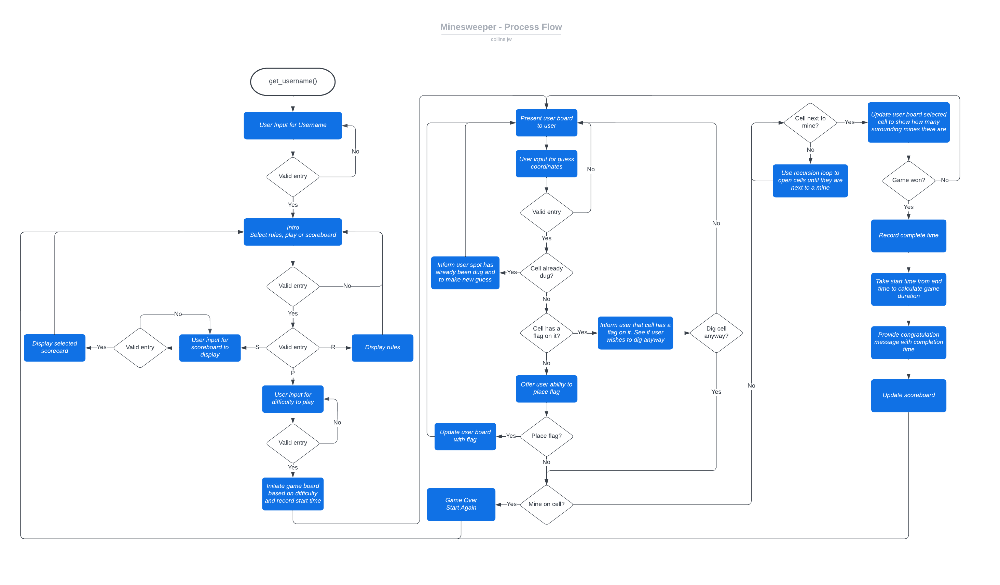
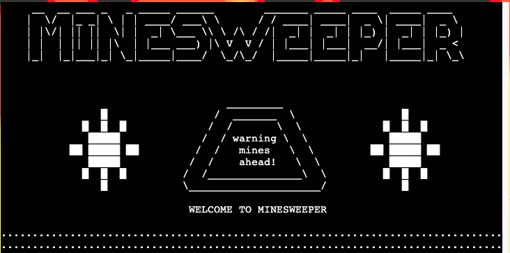

Welcome Joe-Collins-1986,

This is the Code Institute student template for deploying your third portfolio project, the Python command-line project. The last update to this file was: **August 17, 2021**

## Reminders

* Your code must be placed in the `run.py` file
* Your dependencies must be placed in the `requirements.txt` file
* Do not edit any of the other files or your code may not deploy properly

## Creating the Heroku app

When you create the app, you will need to add two buildpacks from the _Settings_ tab. The ordering is as follows:

1. `heroku/python`
2. `heroku/nodejs`

You must then create a _Config Var_ called `PORT`. Set this to `8000`

If you have credentials, such as in the Love Sandwiches project, you must create another _Config Var_ called `CREDS` and paste the JSON into the value field.

Connect your GitHub repository and deploy as normal.

## Constraints

The deployment terminal is set to 80 columns by 24 rows. That means that each line of text needs to be 80 characters or less otherwise it will be wrapped onto a second line.

-----
Happy coding!

# MINESWEEPER GAME

# ("\U0001F4A5")
# ("\U0001F6A9")

# Table Of Contents
- [Minesweeper Project Overview](#minesweeper-project-overview)
   - [Live Project](#live-project-link-to-live-project)
   - [Project Introduction](#project-introduction)
- [Responsive Review](#responsive-review)
   - [Am I Responsive?](#am-i-responsive-link-to-responsive-review-website)
   - [Development Note on Responsive Design](#development-note-on-responsive-design)
- [User Experience (UX)](#user-experience-ux)
   - [Website Objectives](#website-objectives)
   - [Website Design](#website-design)
   - [Structure Non-Linear Plane](#structure-non-linear-plane)
   - [Wireframes](#wireframes)
   - [Features](#features)
- [Further Development](#further-development)
- [Technologies Used](#technologies-used)
   - [Languages Used](#languages-used)
   - [Frameworks, Libraries & Programs Used](#frameworks-libraries-and-programs-used)
- [Testing](#testing)
   - [HTML Validator Results](#html-validator-results)
   - [CSS Validator Results](#css-validator-results)
   - [JS Validator Results](#js-validator-results)
   - [Console Log Warning](#console-log-warning)
   - [Lighthouse Accessibility Results](#lighthouse-accessibility-results)
   - [Testing User Stories from User Experience (UX) Section](#testing-user-stories-from-user-experience-ux-section)
   - [Further Testing](#further-testing)
   - [Development Bugs](#development-bugs)
   - [Key Learn](#key-learn)
- [Deployment](#deployment)
   - [Set Up Local GitHub Repository](#set-up-local-github-repository)
   - [Repository Framework](#repository-framework)
   - [Update Repository](#update-repository)
   - [GitHub Pages](#github-pages)
- [Credits](#credits)
   - [Development Resources](#development-resources)
   - [Media Resources](#media-resources)
   - [Acknowledgements](#acknowledgements)

 

# Tasks:
- check links on TOC
- find credits to add

# Minesweeper Project Overview
   ## Live Project [*(link to live project)*](https://minesweeper-python-project.herokuapp.com/)

   ## Project Introduction
   (**Note:** The aim of this project will be to develop the classic game 'Minesweeper'. This game will be devloped using Python and will be deployed using mock terminal on the Heroku platform.

   Minesweeper is a challanging single player logic game where the user must select tiles on a grid without hitting a mine. If the user successfully selects a tile without hitting a mine then the tile will provide information as to whether a mine or multiple mines are hidden within its neighbouring tiles. This is presented in the form of numbers, a tile with 3 mines in neighbouring tiles will present the user with the number 3.

   If the user selects all tiles on the grid without mines they win the game, however if they land on a tile hiding a mine the game is lost.

   If you would like to learn more about Minsweeper you can find more information here: https://en.wikipedia.org/wiki/Minesweeper_(video_game)

    

# Responsive Review

   ## Am I Responsive? [*(link to responsive review website)*](https://ui.dev/amiresponsive?url=https://minesweeper-python-project.herokuapp.com/)
   

   ## Development Note on Responsive Design
   The objective of this project was to develop a Python command-line application and was not focused on developing a responsive website. 
   As this was not in the scope of the project it was not given consideration.
   
    

# User Experience (UX)

   ## Project Objectives

   

      
Developer Goals

   As the developer I want to create a simple and engaging game that is easy to use and will result in users returning to the site. 
   * Easy to use functionality.
   * Addictive gameplay to encourage return users and drive positive word of mouth to encourage new users.
   * Provide clear instruction as to the rules of the game.
   * Set a range of difficulties to allow user progression and continued engagment.
   * Record winning scores based on difficulty and completion time to promote re-vistiation and competition between users.
   * Build in flag functionality to allow users to mark cells they believe to have mines.
   * Build a appealing user interface whilst observing the limitations of the project scope(command-line application).
   
   ---
   

   

      
Developer Future Goals

   
   Points to consider for future development:
   * Potential to implement a more userfriendly interface such as tkinter or pygame (excluded as not in scope for this project).
   * Build to be responsive (excluded as not in scope for this project).
   * If responsive design is set-up then a customised difficulty could be implemented to allow the user to generate a board with a their desired size and number of mines. This was not feasible in this project as it may have exceeded the console size available.

   ---
   

   

      
First-Time User Goals

   * Understand the purpose of the site.
   * Immediately engaged by easy to use yet challanging gameplay.
   * Invoke nosatalgia.
   * Simple intuitive menu navigation.
   * Rules easliy located and understood.

   ---
   

   

      
Returning User Goals

   
   * Use the scoreboard to improve their scores and compete with other users.
   * Tailor the difficulty to their experience with the game.

   ---
   

   ## HTML/CSS Design
   The focus of this project was to develop a command-line application. HTML and CSS development was not in scope for this project.

   However, I did tailor the course provided HTML and CSS files slightly to produse a more engaging user experience.

  

      
Background

   Utilised a SVG file from https://freesvg.org: 
    

   ---

   

   

      
Position of terminal

   Centred the terminal console on the page and increaed it's size to cols: 80, rows: 50 to accommodate the game layout. 
   

   ---

   

   

      
Run program button

   Button also centred and colours changed to be inkeeping with the game theme and backgroung colour scheme. 
   

   ---

   

   

      
Flavicon

   Flavicon updated for better user experience. 
   

   ---

   

   ## Wireframes

   Only a skeleton plane has been developed for this project due to it being a command-line application and therefore having pre-set formating.

   - [Skeleton Plane](https://www.figma.com/file/M0wxItI1Bx3Nh4LRIBNp1e/Untitled?node-id=0%3A1)

   **Note:** The structure and wireframes are only to act as a concept and are subject to change as the game development evolves.

   ## Features

   ### **Features planning**

   

      
Mind-Map

    
   The below image provides an initial mind-map into what features might be appropriate for the game based on the set objectives.

   
   If you have a LucidChart account you can also view this Mind-Map [here](https://lucid.app/lucidspark/e0824881-e88c-4530-937e-03f8b923e9b2/edit?viewport_loc=-953%2C-1%2C3247%2C1693%2C0_0&invitationId=inv_d875bc30-8e51-4375-b0f2-c2a63991877b)
    

   ---

   

   

      
Priority Matrix

    
   The below maps out the feaibility of the features considered against the user value they provide to help establish the priortiy they have as part of the build.

   
   If you have a LucidChart account you can also view this priority matrix [here](https://lucid.app/lucidspark/4b1e28c9-055d-4535-87d6-0f258286fe20/edit?viewport_loc=-2982%2C2311%2C4151%2C2041%2C0_0&invitationId=inv_67402cc9-c065-4b2a-ac9d-b9c360a0b967)
    

   Following this review the build order of the features will be broken down into phases:

   #### Phase 1:
   - Gameplay
   - Validations
   - Rules
   - Difficulty

   #### Phase 2:
   - Clear screen
   - Titles

   #### Phase 3:
   - Scoreboard
   - Username (useless without scoreboard)

   #### Phase 4 (Future enhancements - currently out of scope):
   - User interface (e.g. tkinter, pygame)

   ---

   

   

      
Process Flow

    
   The below details the process flow for the game from beginning to end.

    
   If you have a LucidChart account you can also view this process flow [here](https://lucid.app/lucidchart/6f4a551a-5f6e-43eb-9645-1834994d4e27/edit?viewport_loc=-136%2C-64%2C3656%2C1771%2CI~k5YlUlNz8V&invitationId=inv_4642de00-28f1-4eff-8cd1-fe81b08e943d)
    

   ---

   

   

      
Functions Flow

    
   The below demonstrates the key game functions and how they interact with each other. It also details the inclusion of the Gameplay class.

    
   If you have a LucidChart account you can also view this functions flow [here](https://lucid.app/lucidchart/6f4a551a-5f6e-43eb-9645-1834994d4e27/edit?viewport_loc=-391%2C-96%2C4221%2C2189%2CMrp4u2cXQ7zq&invitationId=inv_4642de00-28f1-4eff-8cd1-fe81b08e943d)
    

   ---
   
   

   

      
Class Requirements

    
   The below breaks down the Gameplay class detailing it's purpose, class variables and methods.

    
   If you have a LucidChart account you can also view this class requirements [here](https://lucid.app/lucidchart/6f4a551a-5f6e-43eb-9645-1834994d4e27/edit?viewport_loc=-1010%2C-180%2C3889%2C2017%2CVWq4R58lY_hn&invitationId=inv_4642de00-28f1-4eff-8cd1-fe81b08e943d)
    

   ---
   
   

   ### **Features breakdown**

   Each section below will detail their specific function.
   

   

      
HTML/CSS

    

   The HTML and CSS development was not in scope for this project. However, small ammendments were made to the template provided by the course to align better with the game aesthetics and accomodate the termainal size requirements.

   ---

   #### Console size and position
   Console was centred for a cleaner look.
   It was also increased from '80 columns by 24 rows' to '80 columns by 50 rows' to allow for additional info to be provided without the user needing to scroll on the page. This was especially inportant for higher difficulty games as the grid took up a substancial amount of the space available.

   
    

   ---

   #### SVG img
   An SVG image was used in the background.
   Due to the build I was not able to implement a png background and instread imput the SVG coordinates directly into the layout.html file.

   
    

   ---

   #### Flavicon
   Flavicon updated for better user experience. 
   This could not be achieved through the normal process of storing a flavicon icon in the root directory and instead had to link to an external web image.

   
    

   ---

   

   

      
Titles

    

   To enhance the asthetics of the game without using a interface library such as pygame or tkinter I used pyfiglet to make more engaging titles and to help the user seperate and navigate the various pages/functions.

   ---

   #### Import required
      import pyfiglet
      from pyfiglet import figlet_format 
    

   ---
   #### Home page
   For the Intro and home page I wanted to generate a more impactful title. This would make users instantly aware of what they are playing and invoke a positive emotional response.

   
    

   ---

   #### Other pages
   For each of the other pages I also used pyfiglet to make an impactful title. 
   See an example of a title (rules) below.  
   This was applied to:
   - Rules
   - Scoreboard Selection
   - Scoreboard
   - Gameplay
   - Win
   - Gameover

   
    

   

   

      
Clear Board

    

   To ensure that the terminal does not get too cluttered and the user is not provided more information than they need to play the game I utilised a clear function which I obtained from stack overflow: 
   https://stackoverflow.com/questions/517970/how-to-clear-the-interpreter-console

   This function was stored on another py sheet (format.py) to avoid clutter on the main run.py file.

   ---

   #### Import required
      import os
    

   ---

   #### Function code
      def cls(): 
         os.system('cls' if os.name=='nt' else 'clear')
    

   

   

      
Username

    

   Set a requirement for the user to enter a username. This username is passed through the functions and used in the scorebaord update if the user wins a game. 

   Upon playing a new game following a win or loss the user will not be required to re-enter their username.

   ---

   #### Username format
   To appear consistantly on the scoreboard each username was set to be 10 characters long. 
   This was achieved by running a while loop that added a space to the end of the word until it's length equalled 10.

      while len(user_name) < 10:
         user_name = user_name + " "
    

   ---

   

   

      
Rules

    

   Rules has little complexity and is simply a breakdown of the instructions required to play the game.

   This was spit into 2 pages for readability and also to eliminate a bug identified in manual testing. This bug is detailed in the [Development Bugs](#development-bugs) section of this readme file.

   ---

   #### Imports required
   To format the title the pyfiglet is required. 

      import pyfiglet
      from pyfiglet import figlet_format
    

   ---

   #### Page 1
   This page provides a link to an instruction video on youtube and the game objectives.
   It has a input field which will take any user-input entered to move onto the next page of the rules breaking down the instructions.

   
    

   ---

   #### Page 2
   This details the instruction required to play the game.
   It also has a input field which will take any user-input entered to move back to the home navigation page.

   
    

   ---

   

   

      
Scoreboard

    

   The scoreboard utilises the username which has been entered at the commencement of the game as well as the time the gameplay begins and ends if the user wins. It then updates a specific google sheet dependant on the difficulty the user played and presents the top 5 scores back to the scoreboard screen.

   ---

   #### Imports required
   This scoreboard requies an API link with google sheets. 

      import gspread
      from google.oauth2.service_account import Credentials

   The time is used to take a start time and end time which is then used to calculate the game duration.
   Math import is used to round down seconds with math.floor. (The standard round function could round up to 60 which may result in a 0min 60secs time). 

      import time
      import math

   To format the title the pyfiglet is required. 
   
      import pyfiglet
      from pyfiglet import figlet_format
    

   ---

   #### Define constants
   Using the tutorial provided as part of the 'love-sandwiches' course project, I defined the constants I would require to read and update the google sheet utilising the imports above. 
   (https://learn.codeinstitute.net/courses/course-v1:CodeInstitute+LS101+2021_T1/courseware/293ee9d8ff3542d3b877137ed81b9a5b/071036790a5642f9a6f004f9888b6a45/?child=first) 

      SCOPE = [
         "https://www.googleapis.com/auth/spreadsheets",
         "https://www.googleapis.com/auth/drive.file",
         "https://www.googleapis.com/auth/drive"
         ]

      CREDS = Credentials.from_service_account_file("creds.json")
      SCOPED_CREDS = CREDS.with_scopes(SCOPE)
      GSPREAD_CLIENT = gspread.authorize(SCOPED_CREDS)
      SHEET = GSPREAD_CLIENT.open("Minesweeper_scoreboard")
    

   ---
   
   #### Page 1
   This page allows the user to select the appropriate scoreboard. Each difficulty level has it's own scoreboard( easy, medium, hard).

   
    

   ---

   #### Page 2
   Once the game is won, the game duration is calculated and recorded alongside the difficulty and username. This is then imported to the google sheets. 
   When the scoreboard page is called it presents back the top 5 scores on the specified google sheet whilst eliminating any unessesary data (difficulty - because this is on the title, time in secs - shown in proper format)

   

   ---

   
    

   ---

   

   

      
Difficulty

    

   The difficulty page allows the user to select a level that is appropriate to their skill and experience with the game.

   ---

   #### Imports required
   To format the title the pyfiglet is required. 

      import pyfiglet
      from pyfiglet import figlet_format
    

   ---

   #### Difficulty selection
   The difficutly options that the user selects will affect the size of the board and the number of mines hidden.

   
    

   ---

   

   

      
Gameplay

    

   The gameplay works by first using a class to generate a board with all the mines and values placed. It then generates a second board which is presented to the user without the mines and value information. Once a user makes a coordinate guess the cell the user guesses on the user board is updated to equal that of the values board.

   If the user selects a cell with a mine they lose, if they select all cells without a mine they win.

   ---

   #### Imports required
   Class is assigned to board in gameplay to set the board relative to the board size and mines passed. This then sets the mine postions utilising import random and the values in realtion to those mines. The class is called to  update the userboard with guesses and return a visual userboard to the console. 

      import game_layout
      import random (called in class GameLayout)

   To format the title the pyfiglet is required. 

      import pyfiglet
      from pyfiglet import figlet_format

   To take the start time of the game which will later be used to calculate the game duration in the win function. 

      import time

    

   ---

   #### Starting board
   The board board size and number of mines depends on the difficulty selected by the user.
   Each round a board is presented to the user showing the values from their prevous guesses.

   
    

   ---

   #### Enter coordates
   The user will then enter coordinates in the following format (row coloumn).
   They will then be offered the opportunity to place a flag. If the user enter 'n' the space will be revealed.

   
    

   ---

   #### Selected number value
   If the user selects a cell which is next to a mine it will present a number. The number will reference how many mines are in it's neighbouring cells.

   

   
    

   ---

   

   

      
xx

    

   xx

   ---

   #### xx
   xx

   
    

   ---

   

   
   
    

# Further Development
   * Add additional categories to the hangman game.
   * Use web scraping to generate full word lists for future categories.
   * Add optional timer to game.
   * Provide language options to game.
   * Retain scores using back-end development to provide a scoreboard for users.
   * Add additional games.
   * Add advertisements to site to generate revenue.
   
    

# Technologies Used

   ## Languages Used

   - HTML (not in scope but used to a minor extent)
   - CSS (not in scope but used to a minor extent)
   - Python

   ## Frameworks, Libraries and Programs Used

   1. Google Fonts:
      - Used to obtain appropriate fonts to use in website not held as standard.
   2. Font Awesome:
      - Used to obtain several icons used to improve the visuals of the website.
   3. Git:
      - Used for version control and to Push to GitHub.
   4. GitHub:
      - Used to store and share the code as well as publish to live website.
   6. Figma:
      - Used to plan out website format.
   7. Web Developer:
      - Used to analyse HTML, CSS and JavaScript output and correct where required.
   8. Canvas:
      - Used to draw the hangman on JS.

    

# Testing
   ## HTML Validator Results: 
   - [HTML index page](https://validator.w3.org/nu/?showsource=yes&doc=https%3A%2F%2Fjoe-collins-1986.github.io%2FHangman%2F)

   

      
HTML Issue Resolutions

   ### Warnings
   Following the HTML validation, the following warnings were identified and addressed.

   

   ---

   #### **Resolutions**
   **Points 1 - 2:**
   These were initially implemented as li items acting as a menu option directing to additional content. However, removed aria-label following best practice due to no href.

   ---

   **Points 3 - 7:**
   All ID first occurrences were addressed by changing duplicate IDs to classes.

   ---

   **Points 8:**
   Placed empty quotes into h2 space to remove error. This header is produced by JS.

   ---

   ### Errors
   Following the HTML validation, the following errors were identified and addressed.

   

   ---

   #### **Resolutions**
   **Point 1:**
   Delete stray div tag.

   ---

   **Points 2 - 6:**
   - Replace IDs with Classes and update CSS to .element as opposed to #element.
   - Checked ID was not used in JS.
   - Removed duplicate class syntax e.g. class="settings-pin" class="pin-right". This was changed to class=”settings-pin pin-right”.

   ---

   **Points 7 - 10:**
   Mute is defaulted as true so no need to specify. Therefore removed = “true”.

   ---
   

   ## CSS Validator Results
   - [CSS validator results](https://jigsaw.w3.org/css-validator/validator?uri=https%3A%2F%2Fjoe-collins-1986.github.io%2FHangman%2F&profile=css3svg&usermedium=all&warning=1&vextwarning=&lang=en)

   

      
CSS Issue Resolutions

   ### Warnings & errors
   Following the CSS validation, the following warnings and errors were identified and addressed.

   

   ---

   **Points 1 - 2:**
   Removed unnecessary semi-colon.

   ---

   **Warning Provided:** 'Imported style sheets are not checked in direct input and file upload modes'.

   **Stack Overflow Response to Warning:** You're just trying to validate your CSS file using the W3C validator, and it's letting you know that it's not going to validate the imported style sheet (Google's). It's not an error, just some information for you.

   ---
   

   ## JS Validator Results
   

   

      
JS Issue Resolutions

   ### Errors
   Following the JS validation the following errors were identified and addressed.

   **Points - define variables:**  
   

   Errors resolved by declaring i in the relevant for loops.

   ---

   **Points - template literal syntax:**  
   

   Cause by use of Font Awesome. no detriment to usage. Site functioning as expected. Following consultation with my mentor no action was required.

   ---

   **Points - functions declared within loops referencing an outer scoped variable:**  
   

   Utilising outer scoped variables. No issues caused by this, and maintenance is acceptable. Following consultation with my mentor no action was required.

   ---

   **Points - expected a conditional expression and instead saw an assignment.:**  
   

   Functions built with if statements, with no else option. No errors occurring. Following consultation with my mentor no action was required.

   ---

   **Points - level not defined.:**  
   

   HTML ID not defined as a variable. Created a variable for this and stored as level.

   ---

   **Points - 	'i' is not defined.:**  
   

   Declare i as a variable.

   

   ## Console Log Warning
   

   

      
Console Log Warning Review

   On refreshing the page a warning was highlighted on the console log. I used Stack Overflow to investigate the potential impact of this warning.

   Stack Overflow findings:

      Basically you can ignore it. GitHub hosted pages disable FLoC, which is Google's 3rd party cookie alternative. GitHub, Microsoft, doesn't seems to like it.

   Following this review and consultation with my mentor no action was required for this warning.

   

   

   ## Lighthouse Accessibility Results:
   

   ## Testing User Stories From User Experience (UX) Section

   

      
Client Goals

   The client wants a simple and engaging game that is easy to use and will result in users returning to the site. 
   * Sleek yet simple UX design.
      - **REVIEW - UX design kept minimalist. Simple, clear colour scheme with engaging visuals to make the page look like it is being completed on a notepad as one might historically play hangman.**
   * Easy to use functionality.
      - **REVIEW - Simple intuitive buttons/functions. Built without overcomplicating and game requirements. All built on one page for simplicity.**
   * Responsive for any device size to encourage mobile use as well as desktop use.
      - **REVIEW - Built with responsive design for all devices. Structure of page amended to best suit the appropriate device size.**
   * Links to the client's social network accounts to enhance their online presence.
      - **REVIEW - Social network links located in footer with clear recognisable images.**
   * Addictive gameplay to encourage return clients and drive positive word of mouth to encourage new users.
      - **REVIEW - Used feedback from testers to build a game which has been well received with testers re-using for their own enjoyment.**
   
   ---
   

   

      
Client Future Goals

   
   Points to consider for future development:
   * Additional words and topics to be added to the hangman game.
      - **REVIEW - Option to add additional lists to the game and increase the existing lists. Code written to make this addition easy to implement.**
   * Allow for scores to be recorded and stored into a leader board.
      - **REVIEW - For future enhancements utilising back-end development, it would be good to store user data and scores to generate a leader board encouraging re-use and competition between users.**
   * Additional games and puzzles added to the site.
      - **REVIEW - Use the site to develop a range of similar games with a consistent aesthetic appeal.**
   * Generate advertisement revenue through the site.
      - **REVIEW - Once web traffic is sufficient use the site to advertise products and services. This must be done in a way to minimise the negative impact on user experience.**

   ---
   

   

      
First-Time Visitor Goals

   * Immediately engaged by the UX design.
      - **REVIEW - Engaging gameplay and visuals developed based on user feedback to ensure an immediate and continued interest in the game.**
   * Understand the purpose of the site.
      - **REVIEW - Very clear game purpose and easy to locate and read rules where required.**
   * Simple intuitive menu navigation.
      - **REVIEW - Menus built to stand out using colour differentiation. Always easily identified on the screen.**
   * Intuitive content and links to social media.
      - **REVIEW - Social Media links easily identifiable and located on the screen.**
   * Readable and aesthetically pleasing on all devices.
      - **REVIEW - Game structure amended to best present on each device size. Smooth responsive alterations on reducing screen size.**

   ---
   

   

      
Returning Visitor Goals

   
   * Revisit to replay game to try different topics.
      - **REVIEW - Multiple topics generated to keep people of different interests engaged. On completion of a topic, it will be unusable (until game reset) giving the user a feeling of accomplishment.**
   * Revisit to replay game to beat previous score.
      - **REVIEW - Accumulating score gives a challenge to users to see how high a score they can generate and try to beat this on re-visits.**
   * Revisit to locate social media links to client.
      - **REVIEW - Social Media links available for anyone trying to link in with the client (These are not set to real accounts for this project due to a fictional client).**

   

   ## Further Testing
   * Tested across Google Chrome, Safari, Microsoft Edge, Fire Fox browsers on both Mac and Windows.
   * Viewed on a variety of devices using Web Developer Tools as well as several live desktop, iPad and mobile devices. 
   * Each page tested by developer and friends to ensure functionality worked as expected.
   * Issued to Slack community to review and provide feedback on.

   ## Development Bugs

   

      
Menu Toggle Issue

   
   On closing settings or rules using the close button on a small screen the menu remains open. I want this to close to improve aesthetics and reduce required button clicks when returning to game.

   

   

   Image shows that after ‘Leave Settings’ is selected the menu remains on screen until the ? icon is selected again.

   Another issue this caused was that if the rules or settings content were opened on a small screen and the ? icon was clicked it would toggle the menu off and need to be clicked again to open the menu options.

   The final issue with the toggle option on the ? icon was that when it was set to on and the screen size was changed to large, when rules or settings were opened and the screen was returned to small the menu overlapped the rules or settings content.

   

   Image shows the menu overlapping rules and settings content.

   By adding the matchMedia code and moving the rules and settings in front of the small screen menu with a CSS z-index of 2 the functionality works as intended.
   
    

   **Code block to resolve:**

      if (matchMedia("(min-width: 821px)").matches) {
            postIt.className = "post-it-contents";
      }
      else {
            postIt.classList.toggle("select");
      }

   ___

   

   

      
Canvas Re-Size

   
   When I initially drew the hangman on the canvas, I had an issue if the screen was re-sized. The image would not re-size along with it.

   By implementing an event listener for window re-size and calculating the canvas images based on a percentage of the canvas height and width I was able to resolve this issue.

   

   Image shows canvas not re-sizing to match screen change.
  
    

   **Code block to resolve:**

      window.addEventListener("resize", function() {
        canvas.width = canvasSize.clientWidth;
        canvas.height = canvasSize.clientHeight;
        hangmanDraw();
      });

   The above code block shows how when the screen size is changed the canvas re-sizes and redraws the required elements.

      function drawBase() {
        ctx.fillRect(canvas.width * 0.2, canvas.height * 0.9, canvas.width * 0.6, 5);
      }
   
   The above code block shows a canvas element calculated based on canvas dimensions.

   ___

   

   

      
Underscore Overlap

   
   When testing the game, it was identified that for long words the underscores overlapped the word output container.

   

   However, when some of the letters were presented as text it did not.

   

   I identified that this was because in the JS code I had put spaces around the underscores. However, I had also set the CSS word output to have a letter spacing of 0.8rem.
  
    

   **Code blocks detailing issue:**

   JS code:

      function underscoreWord() {
         for (let i = 0; i < selectedWord.length; i++) { 
            shownWord[i] = " _ "; //remove spaces from around the underscore
            }
        
            wordOutput.innerHTML = shownWord.join(" ");
         }
   
   CSS code:

      #word-output {
         height: 54px;
         display: flex;
         justify-content: center;
         align-items: center;
         font-size: 2rem;
         font-weight: bold;
         letter-spacing: .8rem; // already has spacing between letters
         background-color: white;
         border: 2px solid black;
         border-radius: 1.2rem;
         margin-bottom: 27px;
      }

   By removing the spacing from the underscore in the JS code, it resolved the issue. 

   Despite this I later decided to make the maximum word length 6 letters. This was because when the text size was reduced to fit the output container for a small screen it was becoming challenging to read the letters.

   In future developments the word output container could be increased to allow for longer words and potentially sentences. 

   

   

   ## Key Learn
   The main key learn I took from this project was to build the readme file in conjunction with the website development.

   I was not sure if the design and functionality were feasible for the development of this project given my limited experience in CSS and JS. Therefore, I spent a lot of time building it in a test environment before deciding I could accomplish the desired result.

   By the time I had realised it was feasible I had completed a lot of the work. As a result of this I had to retrospectively complete sections of the readme file which would have been better suited to completing at the scoping, researching and initial build stages.

   Despite this I feel that I did a good job recording my progress through easy-to-understand concise commits which made it easier to revisit certain elements of the project where necessary.

    

# Deployment
   ## Set Up Local GitHub Repository
   1. Go to https://github.com/Code-Institute-Org/gitpod-full-template.
   2. Select use this template.
   3. Add repository name within my GitHub. (This will generate a repository in my Git Hub with the appropriate files.)

   ## Repository Framework
   1. Select the repository on GitHub and open with GitPod (green button).
   2. Create required html page.
   3. Create assets folder.
   4. Within assets folder create CSS folder, images folder, JS folder & readme-assets folder.
   5. Add required files to folders including style.css, images, script.js, etc.

   ## Update Repository
   1. When adding a new feature create a separate branch to work in safely typing into the terminal "git branch 'name of required feature/update'".
   2. Checkout the branch with "git checkout 'name of required feature/update'".
   3. Make updates and test using "python -m http.server".
   4. Once testing is complete add to Git staging area using "git add ."
   5. Commit the changes and add a useful explanation of what action was done to track the history in GitHub using "git commit -m 'explanation of update'".
   6. Once the feature is complete, fully tested, and ready to be added to the main branch first go to the main branch using "git checkout main".
   7. Merge the feature branch into the main using "git merge 'name of required feature/update'".
   8. Confirm merge was successful and then if it is not going to be re-used delete the feature branch using "git branch -d 'name of required feature/update'". (If deleting a branch with commits not merged to main delete with -D instead of -d)
   9. Use "git push" to push the commits to GitHub. These will then appear in the live website if it has been set up in GitHub Pages.

   ## GitHub Pages
   Deploy in GitHub Pages:
   1. Log in to my GitHub and go to my appropriate repository.
   2. Access settings.
   3. Under 'Code and Automation' go to pages.
   4. Leave the source as Deploy from Branch.
   5. Set Branch to Main.
   6. Save.
   7. Give GitHub a few minutes and the live URL is provided at the top of the GutHub Pages section of settings.
   8. Any Git Pushes from the terminal whilst working on the repository using GitPod will now update in this live site.

    

# Credits
   ## Development Resources
   The following sources acted as guidance for understanding. No code was taken directly for use in this project.

   * Learning how to use linear gradients. This was used to develop the look of a notepad with re-occurring lines. (https://www.w3schools.com/css/css3_gradients.asp), (https://codepen.io/ceg9498/post/creating-lined-paper)
   * FlexBox guidance/re-fresh. (https://css-tricks.com/snippets/css/a-guide-to-flexbox/)
   * Intro to canvas in JS to create the hangman image. (https://developer.mozilla.org/en-US/docs/Web/API/Canvas_API/Tutorial)
   * Canvas responsive. (https://stackoverflow.com/questions/34772957/how-to-make-canvas-responsive)
   * Clearing the canvas. (https://stackoverflow.com/questions/2142535/how-to-clear-the-canvas-for-redrawing)
   * Understanding event listeners. (https://www.w3schools.com/js/js_htmldom_eventlistener.asp)
   * Change mouse pointer on hover for menu list items (https://www.w3schools.com/cssref/pr_class_cursor.asp)
   * Understand the toggle class method to utilise in menu activation. (https://www.w3schools.com/howto/howto_js_toggle_class.asp)
   * Set JS rules dependent on-screen size. (https://www.w3schools.com/jsrEF/met_win_matchmedia.asp)
   * Wrap entire game in an initialise function to eliminate global variables. (https://www.youtube.com/watch?v=_4V4yUxGng8)
   * Stack Overflow used for generalised queries during development.

   ## Media Resources
   * All images were obtained from Unsplash.
      - Image for the background wood effect (jon-moore-5fIoyoKlz7A-unsplash.jpg).
      - Image of the mountain doodle which shows on large screen viewings (nicolas-pinilla-GcDr6ZIzbIw-unsplash.jpg).
   * Audio was taken form YouTube videos
      - Sound on correct answer. (https://www.youtube.com/watch?v=403gX7TnhTQ)
      - Sound on incorrect answer. (https://www.youtube.com/watch?v=RZEsfS1rGyY) - modified using Audacity
      - Sound on getting word correct. (https://www.youtube.com/watch?v=ytjxf9YNJ-0) - modified using Audacity
      - Sound on getting word incorrect. (https://www.youtube.com/watch?v=na-a3lLB13Q&t=16s) - modified using Audacity

   ## Acknowledgements
   * Thank to my Mentor (Spencer Barriball) for his feedback and guidance.
   * The Code Institute Slack community for helping with any and all queries.